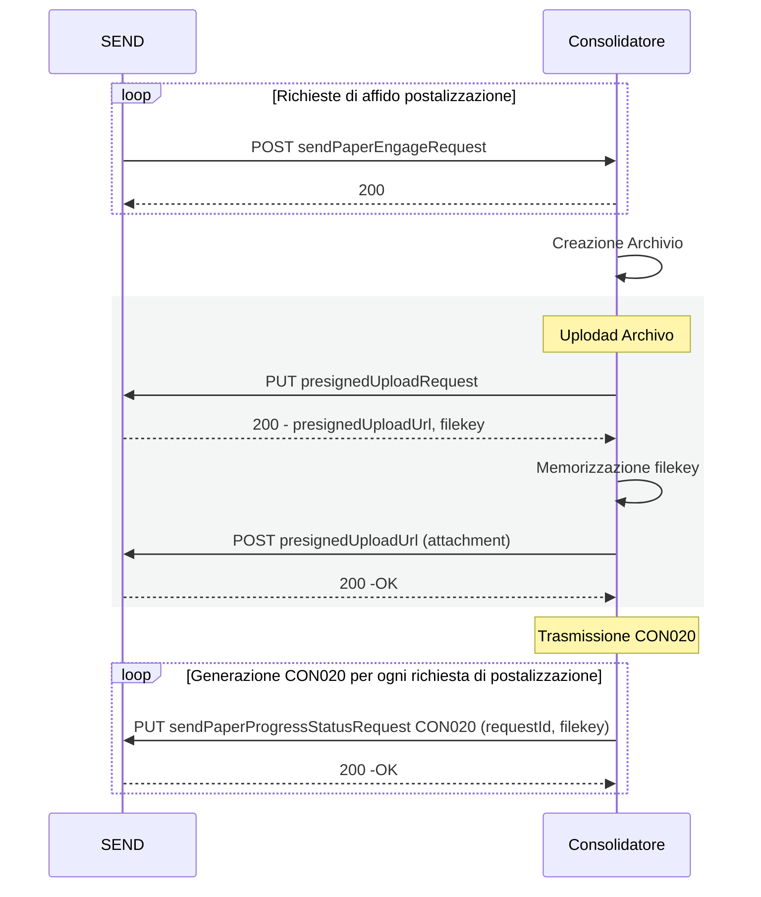

# Servizio per la trasmissione dell'originale digitale dell’AAR stampato

Il presente documento descrive le modalità di trasmissione dell'originale digitale dell'AAR stampato, ovvero del primo foglio della richiesta di stampa (fronte/retro se la stampa è configurata in questo modo) arricchito con gli elementi propri del recapito (fare riferimento al capitolato per ulteriori dettagli).

## Flusso Principale

1. Il consolidatore costruisce di un archivio con compressione (`zip`/ `7zip`) firmato e marcato temporalmente.
All'intenro dell'archivio dovranno essere contenuti tutti i signoli PDF contenuti nel lotto di stampa e un file di accompagnamento `BOL` che li descrive.
    * Ogni file PDF dovrà avere come estensone `.pdf` e dovrà contenere solo il primo foglio della singola stampa (fare riferimento al capitolato per approfondire le specifiche di firma e marca sui singoli pdf)
    * La struttura del file `BOL` viene descritta in appendice
1. Il pacchetto firmato e marcato temporalmenete viene compresso ulteriormente e trasmesso in modalità stream su SafeStorage
1. In fase di rendicontazione degli avanzamenti sulla singola richiesta [sendPaperProgressStatusRequest](./openapi/send-ec-v1.yml) viene generato un evento CON020 che referenzia il file SafeStorage appena caricato
    * tutte le richieste che afferiscono allo stesso lotto di stampa avranno specifici eventi CON020 tutti con riferimento allo stesso file safestorage: l'archivio deve essere trasemsso a SafeStorage una sola volta.

## Appendice

### Struttura file BOL
Il file ha come estesione `.bol` ed è un file testuale CSV con campi separati dal caratterre `|` (pipe)
* L’header contiene inforrmazioni sul flusso ovvero comuni a tutte le comunicazioni del flusso.
* Il body è costituito da un record per ogni comunicazione, ciascun record contiene informazioni relative ad una comunicazione.

Per la corretta ricezione dell'evento CON020 da SEND è necessario implementare le seguenti specifiche:
* La struttura del body deve rispettare le seguenti posizioni (dove con `0` si indica la prima e a `n-1` l'ultima)
    * posizione `0` -  nome del file contenuto nell'archivio - l'estensione del file deve essere `.pdf`
    * posizione `4` - requestId della specifica postalizzazione ricevuto da SEND
    * posizione `7` - codice raccomandata associato alla specifica postalizzazione
* Struttura dell'header e altri valori da inserire nel body vengono lasciati a discrezione del consolidatore

