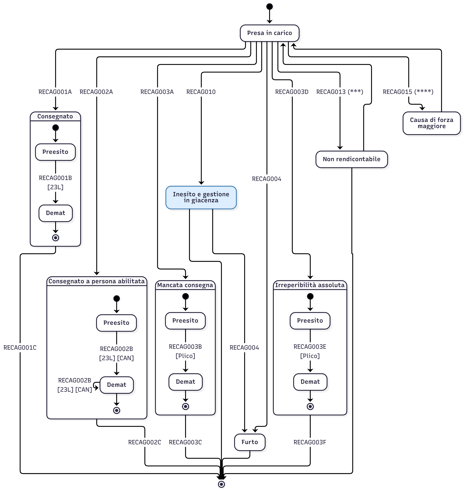
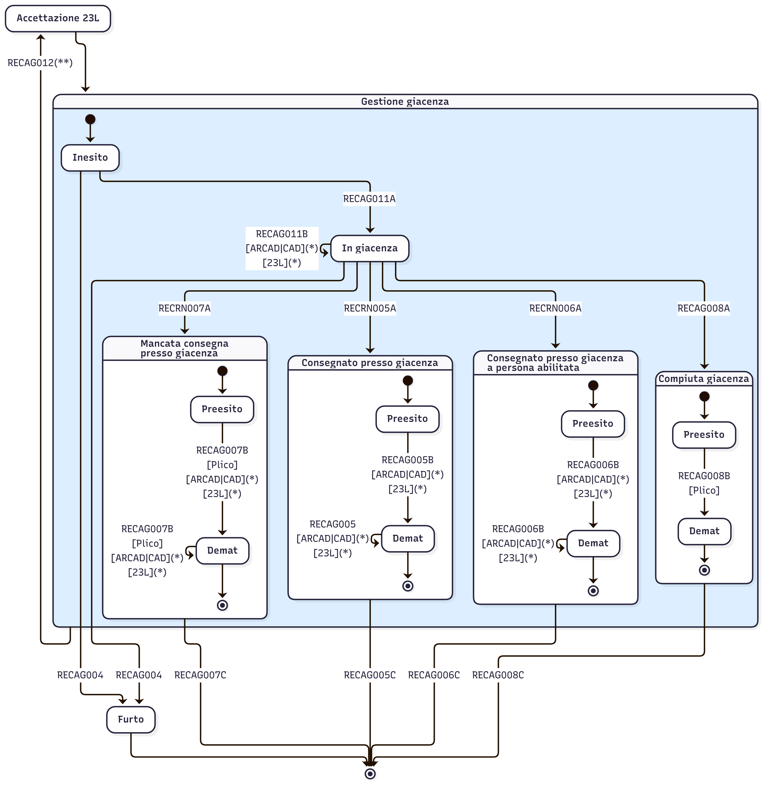

# Macchina a stati prodotto 890





(\*) le demat possono essere generate in questo stato o meno, tutte le demat dovranno essere generate prima del fascicolo chiuso.

(\**) L'evento RECAG012 rappresenta l'accettazione del 23L. Lo `statusDateTime` dovrà essere valorizzato con la seguente logica: data di ritiro in caso di consegna in giacenza antecedente i 10 gionri dall'invio della CAD, oppure data di invio della CAD + 10 giorni. La macchina a stati non risente della produzione di questo evento, il flusso di rendicontazione continua a partire dal precedente evento ricevuto.

<details>
  <summary>Codice Mermaid</summary>

Diagramma 1
```
---
config:
  layout: elk
  elk:
    mergeEdges: false
    nodePlacementStrategy: NETWORK_SIMPLEX
  theme: redux
---
stateDiagram-v2
  direction TB

  state Consegnato {
    direction TB
    [*] --> Preesito1
    Preesito1 --> Demat1: RECAG001B<br>[23L]
    Demat1 --> [*]
  }
  
  state ConsegnatoPersonaAbilitata {
    direction TB
    [*] --> Preesito2
    Preesito2 --> Demat2: RECAG002B<br>[23L] [CAN]
    Demat2 --> Demat2: RECAG002B<br>[23L] [CAN]
    Demat2 --> [*]
  }
  state MancataConsegna {
    direction TB
    [*] --> Preesito3
    Preesito3 --> Demat3:RECAG003B<br>[Plico]
    Demat3 --> [*]
  }
  state IrreperibilitaAssoluta {
    direction TB
    [*] --> Preesito3i
    Preesito3i --> Demat3i:RECAG003E<br>[Plico]
    Demat3i --> [*]
  }

  %% Presa in carico
  [*] --> PresaInCarico
  PresaInCarico --> Furto:RECAG004
  PresaInCarico --> Consegnato:RECAG001A
  PresaInCarico --> ConsegnatoPersonaAbilitata:RECAG002A
  PresaInCarico --> MancataConsegna:RECAG003A
  PresaInCarico --> IrreperibilitaAssoluta:RECAG003D

  %% Giacenza
  PresaInCarico --> GestioneGiacenza: RECAG010
  GestioneGiacenza --> [*]

  %% Chiusura fascicolo
  Consegnato --> [*]:RECAG001C
  ConsegnatoPersonaAbilitata --> [*]:RECAG002C
  MancataConsegna --> [*]:RECAG003C
  IrreperibilitaAssoluta --> [*]:RECAG003F

  %% Furto
  Furto --> [*]

  %% Etichette
  PresaInCarico:Presa in carico
  Consegnato: Consegnato
  ConsegnatoPersonaAbilitata: Consegnato a persona abilitata
  MancataConsegna: Mancata consegna
  IrreperibilitaAssoluta: Irreperibilità assoluta
  Preesito1:Preesito
  Demat1:Demat
  Preesito2:Preesito
  Demat2:Demat
  Preesito3:Preesito
  Demat3:Demat
  Preesito3i:Preesito
  Demat3i:Demat

  %% Stile personalizzato
  style GestioneGiacenza fill:#DCEEFF,stroke:#4682B4
```

Diagramma 2
```
---
config:
  layout: elk
  elk:
    mergeEdges: false
    nodePlacementStrategy: NETWORK_SIMPLEX
  theme: redux
  themeVariables:
    altBackground: '#fff'
    background: '#DCEEFF'
---
stateDiagram-v2
  GestioneGiacenza --> Accettazione23L: RECAG012(**)
  Accettazione23L --> GestioneGiacenza
  
  state GestioneGiacenza {
    direction TB
    
    [*] --> Inesito

    state ConsegnatoPressoGiacenza {
      direction TB
      [*] --> Preesito_5
      Preesito_5 --> Demat_5: RECAG005B<br>[ARCAD|CAD]\(\*\)<br>[23L]\(\*\)
      Demat_5 --> Demat_5: RECAG005<br> [ARCAD|CAD]\(\*\)<br>[23L]\(\*\)
      Demat_5 --> [*]
    }
    state ConsegnatoPressoGiacenzaPersonaAbilitata {
      direction TB
      [*] --> Preesito_6
      Preesito_6 --> Demat_6: RECAG006B<br>[ARCAD|CAD]\(\*\)<br>[23L]\(\*\)
      Demat_6 --> Demat_6: RECAG006B<br>[ARCAD|CAD]\(\*\)<br>[23L]\(\*\)
      Demat_6 --> [*]
    }
    state MancataConsegnatoPressoGiacenza {
      direction TB
      [*] --> Preesito_7
      Preesito_7 --> Demat_7: RECAG007B<br>[Plico]<br>[ARCAD|CAD]\(\*\)<br>[23L]\(\*\)
      Demat_7 --> Demat_7: RECAG007B<br>[Plico]<br>[ARCAD|CAD]\(\*\)<br>[23L]\(\*\)
      Demat_7 --> [*]
    }
    %% Compiuta Giacenza
    state CompiutaGiacenza {
      direction TB
      [*] --> Preesito_8
      Preesito_8 --> Demat_8: RECAG008B<br>[Plico]
      Demat_8 --> [*]
    }    
    InGiacenza --> CompiutaGiacenza: RECAG008A
    InGiacenza --> MancataConsegnatoPressoGiacenza: RECRN007A
    InGiacenza --> ConsegnatoPressoGiacenzaPersonaAbilitata: RECRN006A
    InGiacenza --> ConsegnatoPressoGiacenza: RECRN005A
    Inesito --> InGiacenza: RECAG011A
    InGiacenza-->InGiacenza: RECAG011B<br>[ARCAD|CAD]\(\*\)<br>[23L]\(\*\)
  }

  %% Furto
  Inesito --> Furto: RECAG004
  InGiacenza --> Furto: RECAG004
  Furto --> [*]
  
  %% Chiusura fascicolo
  ConsegnatoPressoGiacenza --> [*]:RECAG005C
  ConsegnatoPressoGiacenzaPersonaAbilitata --> [*]:RECAG006C
  CompiutaGiacenza --> [*]:RECAG008C
  MancataConsegnatoPressoGiacenza --> [*]:RECAG007C

  %% Etichette
  GestioneGiacenza: Gestione giacenza
  InGiacenza: In giacenza
  Inesito: Inesito
  Accettazione23L: Accettazione 23L
  ConsegnatoPressoGiacenza: Consegnato presso giacenza
  ConsegnatoPressoGiacenzaPersonaAbilitata: Consegnato presso giacenza<br>a persona abilitata
  CompiutaGiacenza: Compiuta giacenza
  MancataConsegnatoPressoGiacenza: Mancata consegna<br>presso giacenza

  Preesito_5: Preesito
  Demat_5: Demat
  Preesito_6: Preesito
  Demat_6: Demat
  Preesito_8: Preesito
  Demat_8: Demat
  Preesito_7: Preesito
  Demat_7: Demat
```
</details>
