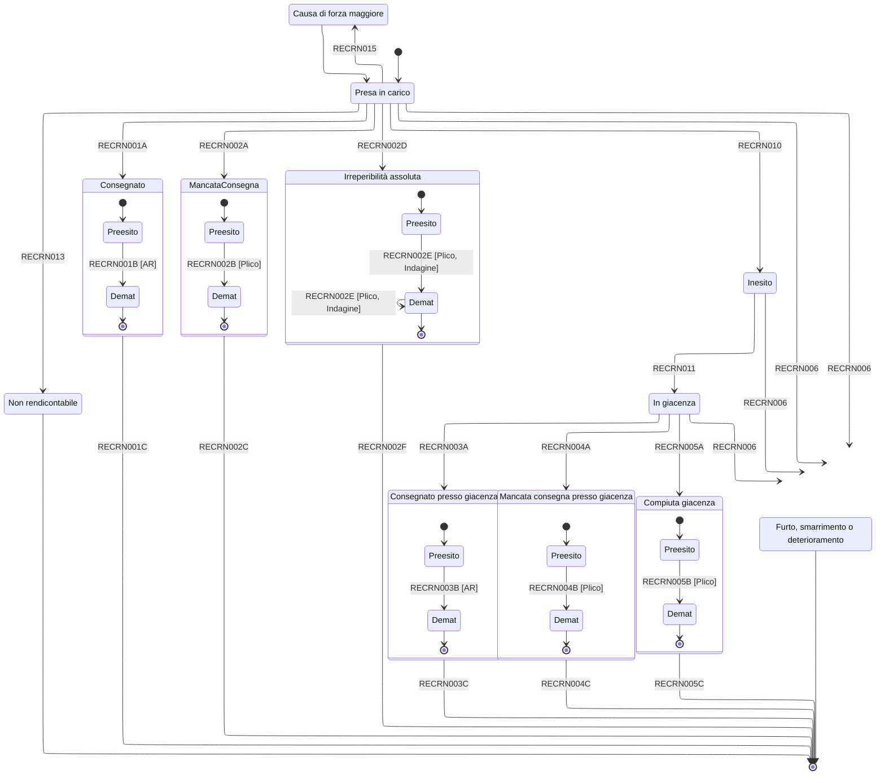

## Macchina a stati prodotto AR

```mermaid
---
config:
  layout: elk
---
stateDiagram-v2
  direction TB
  state Consegnato {
    direction TB
    [*] --> Preesito1
    Preesito1 --> Demat1:RECRN001B [AR]
    Demat1 --> [*]
  }
  state MancataConsegna {
    direction TB
    [*] --> Preesito2
    Preesito2 --> Demat2:RECRN002B [Plico]
    Demat2 --> [*]
  }
  state IrreperibilitaAssoluta {
    direction TB
    [*] --> Preesito2i
    Preesito2i --> Demat2i:RECRN002E [Plico, Indagine]
    Demat2i --> Demat2i:RECRN002E [Plico, Indagine]
    Demat2i --> [*]
  }
  state ConsegnatoGiacenza {
    direction TB
    [*] --> Preesito3
    Preesito3 --> Demat3:RECRN003B [AR]
    Demat3 --> [*]
  }
  state MancataConsegnaGiacenza {
    direction TB
    [*] --> Preesito4
    Preesito4 --> Demat4:RECRN004B [Plico]
    Demat4 --> [*]
  }
  state CompiutaGiacenza {
    direction TB
    [*] --> Preesito5
    Preesito5 --> Demat5:RECRN005B [Plico]
    Demat5 --> [*]
  }

  %% Presa in carico
  [*] --> PresaInCarico
  PresaInCarico --> Consegnato:RECRN001A
  PresaInCarico --> MancataConsegna:RECRN002A
  PresaInCarico --> IrreperibilitaAssoluta:RECRN002D
  PresaInCarico --> Inesito:RECRN010
  PresaInCarico --> Furto:RECRN006
  PresaInCarico --> NonRendicontabile:RECRN013
  PresaInCarico --> CausaForzaMaggione:RECRN015
  CausaForzaMaggione --> PresaInCarico
  NonRendicontabile --> [*]

  %% Chiusura fascicolo
  Consegnato --> [*]:RECRN001C
  MancataConsegna --> [*]:RECRN002C
  IrreperibilitaAssoluta --> [*]:RECRN002F
  ConsegnatoGiacenza --> [*]:RECRN003C
  MancataConsegnaGiacenza --> [*]:RECRN004C
  CompiutaGiacenza --> [*]:RECRN005C
  %% Giacenza
  Inesito --> InGiacenza:RECRN011
  InGiacenza --> Furto:RECRN006
  InGiacenza --> ConsegnatoGiacenza:RECRN003A
  InGiacenza --> MancataConsegnaGiacenza:RECRN004A
  InGiacenza --> CompiutaGiacenza:RECRN005A
  %% Furto
  PresaInCarico --> Furto:RECRN006
  Inesito --> Furto:RECRN006
  Furto --> [*]

  %% Etichette
  Preesito1:Preesito
  Demat1:Demat
  Preesito2:Preesito
  Demat2:Demat
  IrreperibilitaAssoluta:Irreperibilità assoluta
  Preesito2i:Preesito
  Demat2i:Demat
  ConsegnatoGiacenza:Consegnato presso giacenza
  Preesito3:Preesito
  Demat3:Demat
  MancataConsegnaGiacenza:Mancata consegna presso giacenza
  Preesito4:Preesito
  Demat4:Demat
  CompiutaGiacenza:Compiuta giacenza
  Preesito5:Preesito
  Demat5:Demat
  PresaInCarico:Presa in carico
  InGiacenza:In giacenza
  Furto:Furto, smarrimento o deterioramento
  CausaForzaMaggione:Causa di forza maggiore
  NonRendicontabile:Non rendicontabile
```
