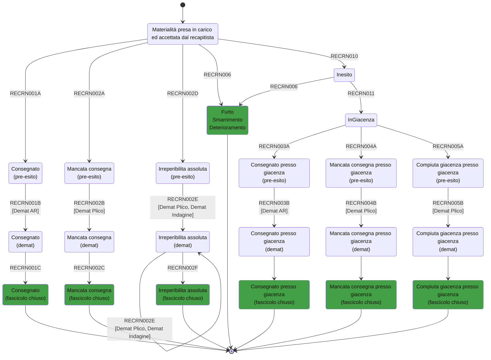
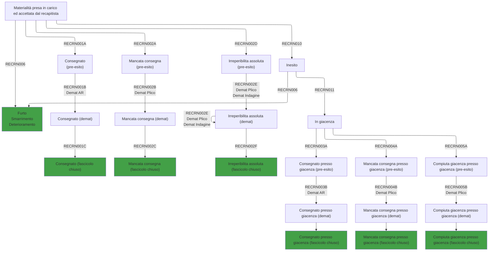

## Esempio Mermaid stateDiagram

```mermaid
stateDiagram-v2
  [*] --> PresaInCarico
  PresaInCarico --> ConsegnatoPreEsito:RECRN001A
  PresaInCarico --> MancataConsegnaPreEsito:RECRN002A
  PresaInCarico --> IrreperibilitaAssolutaPreEsito:RECRN002D
  PresaInCarico --> FurtoSmarrimentoDeterioramento:RECRN006
  FurtoSmarrimentoDeterioramento --> [*]
  PresaInCarico --> Inesito:RECRN010
  %% Consegnato
  ConsegnatoPreEsito --> ConsegnatoDemat:RECRN001B<br>[Demat AR]
  ConsegnatoDemat --> ConsegnatoFascicoloChiuso:RECRN001C
  ConsegnatoFascicoloChiuso --> [*]
  %% Mancata consegna
  MancataConsegnaPreEsito --> MancataConsegnaDemat:RECRN002B<br>[Demat Plico]
  MancataConsegnaDemat --> MancataConsegnaFascicoloChiuso:RECRN002C
  MancataConsegnaFascicoloChiuso --> [*]
  %% Irreperibilita assoluta
  IrreperibilitaAssolutaPreEsito --> IrreperibilitaAssolutaDemat:RECRN002E<br>[Demat Plico, Demat Indagine]
  IrreperibilitaAssolutaDemat --> IrreperibilitaAssolutaDemat:RECRN002E<br>[Demat Plico, Demat Indagine]
  IrreperibilitaAssolutaDemat --> IrreperibilitaAssolutaFascicoloChiuso:RECRN002F
  IrreperibilitaAssolutaFascicoloChiuso --> [*]
  %% Giacenza
  Inesito --> FurtoSmarrimentoDeterioramento:RECRN006
  Inesito --> InGiacenza:RECRN011
  %% Consegnato presso giacenza
  InGiacenza --> ConsegnatoPressoGiacenzaPreEsito:RECRN003A
  ConsegnatoPressoGiacenzaPreEsito --> ConsegnatoPressoGiacenzaDemat:RECRN003B<br>[Demat AR]
  ConsegnatoPressoGiacenzaDemat --> ConsegnatoPressoGiacenzaFascicoloChiuso
  ConsegnatoPressoGiacenzaFascicoloChiuso --> [*]
  %% Mancata consegna presso giacenza
  InGiacenza --> MancataConsegnaPressoGiacenzaPreEsito:RECRN004A
  MancataConsegnaPressoGiacenzaPreEsito --> MancataConsegnaPressoGiacenzaDemat:RECRN004B<br>[Demat Plico]
  MancataConsegnaPressoGiacenzaDemat --> MancataConsegnaPressoGiacenzaFascicoloChiuso
  MancataConsegnaPressoGiacenzaFascicoloChiuso --> [*]
  %% Compiuta giacenza presso giacenza
  InGiacenza --> CompiutaGiacenzaPressoGiacenzaPreEsito:RECRN005A
  CompiutaGiacenzaPressoGiacenzaPreEsito --> CompiutaGiacenzaPressoGiacenzaDemat:RECRN005B<br>[Demat Plico]
  CompiutaGiacenzaPressoGiacenzaDemat --> CompiutaGiacenzaPressoGiacenzaFascicoloChiuso
  CompiutaGiacenzaPressoGiacenzaFascicoloChiuso --> [*]
  %%Alias
  PresaInCarico: Materialità presa in carico ed accettata dal recapitista
  FurtoSmarrimentoDeterioramento: Furto<br>Smarrimento<br>Deterioramento
  ConsegnatoPreEsito: Consegnato<br>(pre-esito)
  ConsegnatoDemat: Consegnato<br>(demat)
  ConsegnatoFascicoloChiuso: Consegnato<br>(fascicolo chiuso)
  MancataConsegnaPreEsito: Mancata consegna<br>(pre-esito)
  MancataConsegnaDemat: Mancata consegna<br>(demat)
  MancataConsegnaFascicoloChiuso: Mancata consegna<br>(fascicolo chiuso)
  IrreperibilitaAssolutaPreEsito: Irreperibilita assoluta<br>(pre-esito)
  IrreperibilitaAssolutaDemat: Irreperibilita assoluta<br>(demat)
  IrreperibilitaAssolutaFascicoloChiuso: Irreperibilita assoluta<br>(fascicolo chiuso)
  ConsegnatoPressoGiacenzaPreEsito: Consegnato presso giacenza<br>(pre-esito)
  ConsegnatoPressoGiacenzaDemat: Consegnato presso giacenza<br>(demat)
  ConsegnatoPressoGiacenzaFascicoloChiuso: Consegnato presso giacenza<br>(fascicolo chiuso)
  MancataConsegnaPressoGiacenzaPreEsito: Mancata consegna presso giacenza<br>(pre-esito)
  MancataConsegnaPressoGiacenzaDemat: Mancata consegna presso giacenza<br>(demat)
  MancataConsegnaPressoGiacenzaFascicoloChiuso: Mancata consegna presso giacenza<br>(fascicolo chiuso)
  CompiutaGiacenzaPressoGiacenzaPreEsito: Compiuta giacenza presso giacenza<br>(pre-esito)
  CompiutaGiacenzaPressoGiacenzaDemat: Compiuta giacenza presso giacenza<br>(demat)
  CompiutaGiacenzaPressoGiacenzaFascicoloChiuso: Compiuta giacenza presso giacenza<br>(fascicolo chiuso)
  style FurtoSmarrimentoDeterioramento,ConsegnatoFascicoloChiuso,IrreperibilitaAssolutaFascicoloChiuso,ConsegnatoPressoGiacenzaFascicoloChiuso,MancataConsegnaPressoGiacenzaFascicoloChiuso,CompiutaGiacenzaPressoGiacenzaFascicoloChiuso,MancataConsegnaFascicoloChiuso fill:#43A047
```
## Esempio Mermaid flowchart

```mermaid
---
config:
  flowchart:
    defaultRenderer: "elk"
---
flowchart TD
  %% Nodi principali
  PresaInCarico["Materialità presa in carico ed accettata dal recapitista"] -->|RECRN001A| ConsegnatoPreEsito["Consegnato<br>(pre-esito)"]
  PresaInCarico -->|RECRN002A| MancataConsegnaPreEsito["Mancata consegna<br>(pre-esito)"]
  PresaInCarico -->|RECRN002D| IrreperibilitaAssolutaPreEsito["Irreperibilita assoluta<br>(pre-esito)"]
  PresaInCarico -->|RECRN006| FurtoSmarrimentoDeterioramento["Furto<br>Smarrimento<br>Deterioramento"]
  PresaInCarico -->|RECRN010| Inesito["Inesito"]

  %% Consegnato
  ConsegnatoPreEsito -->| RECRN001B<br>Demat AR| ConsegnatoDemat["Consegnato (demat)"]
  ConsegnatoDemat -->|RECRN001C| ConsegnatoFascicoloChiuso["Consegnato (fascicolo chiuso)"]

  %% Mancata consegna
  MancataConsegnaPreEsito -->|RECRN002B<br>Demat Plico| MancataConsegnaDemat["Mancata consegna (demat)"]
  MancataConsegnaDemat -->|RECRN002C| MancataConsegnaFascicoloChiuso["Mancata consegna (fascicolo chiuso)"]

  %% Irreperibilita assoluta
  IrreperibilitaAssolutaPreEsito -->|RECRN002E<br>Demat Plico<br>Demat Indagine| IrreperibilitaAssolutaDemat["Irreperibilita assoluta (demat)"]
  IrreperibilitaAssolutaDemat -->|RECRN002E<br>Demat Plico<br>Demat Indagine| IrreperibilitaAssolutaDemat
  IrreperibilitaAssolutaDemat -->|RECRN002F| IrreperibilitaAssolutaFascicoloChiuso["Irreperibilita assoluta (fascicolo chiuso)"]

  %% Giacenza
  Inesito -->|RECRN006| FurtoSmarrimentoDeterioramento
  Inesito -->|RECRN011| InGiacenza["In giacenza"]

  %% Consegnato presso giacenza
  InGiacenza -->|RECRN003A| ConsegnatoPressoGiacenzaPreEsito["Consegnato presso giacenza (pre-esito)"]
  ConsegnatoPressoGiacenzaPreEsito -->|RECRN003B<br>Demat AR| ConsegnatoPressoGiacenzaDemat["Consegnato presso giacenza (demat)"]
  ConsegnatoPressoGiacenzaDemat --> ConsegnatoPressoGiacenzaFascicoloChiuso["Consegnato presso giacenza (fascicolo chiuso)"]

  %% Mancata consegna presso giacenza
  InGiacenza -->|RECRN004A| MancataConsegnaPressoGiacenzaPreEsito["Mancata consegna presso giacenza (pre-esito)"]
  MancataConsegnaPressoGiacenzaPreEsito -->|RECRN004B<br>Demat Plico| MancataConsegnaPressoGiacenzaDemat["Mancata consegna presso giacenza (demat)"]
  MancataConsegnaPressoGiacenzaDemat --> MancataConsegnaPressoGiacenzaFascicoloChiuso["Mancata consegna presso giacenza (fascicolo chiuso)"]

  %% Compiuta giacenza presso giacenza
  InGiacenza -->|RECRN005A| CompiutaGiacenzaPressoGiacenzaPreEsito["Compiuta giacenza presso giacenza (pre-esito)"]
  CompiutaGiacenzaPressoGiacenzaPreEsito -->|RECRN005B<br>Demat Plico| CompiutaGiacenzaPressoGiacenzaDemat["Compiuta giacenza presso giacenza (demat)"]
  CompiutaGiacenzaPressoGiacenzaDemat --> CompiutaGiacenzaPressoGiacenzaFascicoloChiuso["Compiuta giacenza presso giacenza (fascicolo chiuso)"]

  %% Stili
  style FurtoSmarrimentoDeterioramento fill:#43A047
  style ConsegnatoFascicoloChiuso fill:#43A047
  style IrreperibilitaAssolutaFascicoloChiuso fill:#43A047
  style ConsegnatoPressoGiacenzaFascicoloChiuso fill:#43A047
  style MancataConsegnaPressoGiacenzaFascicoloChiuso fill:#43A047
  style CompiutaGiacenzaPressoGiacenzaFascicoloChiuso fill:#43A047
  style MancataConsegnaFascicoloChiuso fill:#43A047
```

