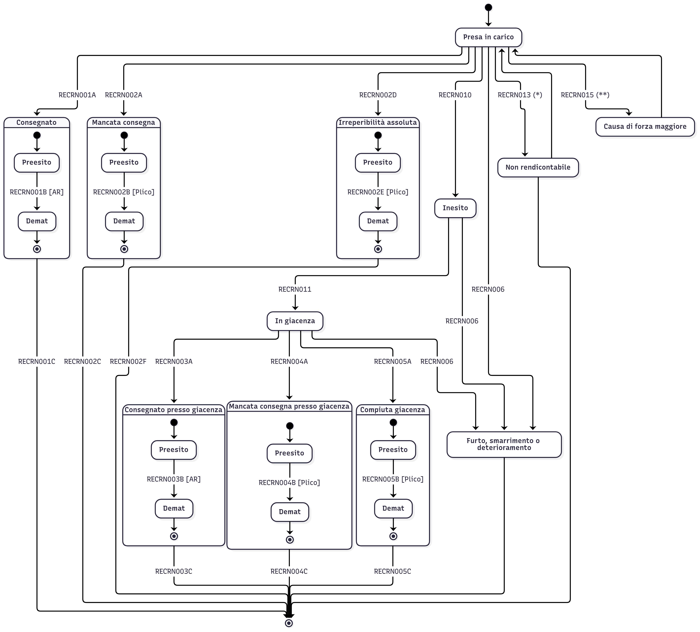

# Macchina a stati prodotto AR



(*) Trattasi di impossibilità di chiusura della rendicontazione, la quale può verificarsi sia come primo esito di rendicontazione sia a seguito di un pre-esito di rendicontazione. Tale evento genera una nuova richiesta di presa in carico da parte del consolidatore generando una nuova spedizione. Nell'eventualità in cui il recapitista dovesse rinvenire informazioni utili al completamento dell'attività di postalizzazione per suddetta raccomandta, questi dovrà procedere alla rendicontazione in conformità alla macchina a stati.

(**) Trattasi di una sospensione della postalizzazione dovuta ad una causa di forza maggiore, la postalizzazione verrà gestita dal recapitista al verificarsi di condizioni favorevoli alla consegna.

<details>
  <summary>Codice Mermaid</summary>

```
---
config:
  layout: elk
  elk:
    mergeEdges: false
    nodePlacementStrategy: NETWORK_SIMPLEX
  theme: redux
---
stateDiagram-v2
  direction TB
  state Consegnato {
    direction TB
    [*] --> Preesito1
    Preesito1 --> Demat1:RECRN001B [AR]
    Demat1 --> [*]
  }
  state MancataConsegna {
    direction TB
    [*] --> Preesito2
    Preesito2 --> Demat2:RECRN002B [Plico]
    Demat2 --> [*]
  }
  state IrreperibilitaAssoluta {
    direction TB
    [*] --> Preesito2i
    Preesito2i --> Demat2i:RECRN002E [Plico]
    Demat2i --> Demat2i:RECRN002E<br>[Plico]
    Demat2i --> [*]
  }
  state ConsegnatoGiacenza {
    direction TB
    [*] --> Preesito3
    Preesito3 --> Demat3:RECRN003B [AR]
    Demat3 --> [*]
  }
  state MancataConsegnaGiacenza {
    direction TB
    [*] --> Preesito4
    Preesito4 --> Demat4:RECRN004B [Plico]
    Demat4 --> [*]
  }
  state CompiutaGiacenza {
    direction TB
    [*] --> Preesito5
    Preesito5 --> Demat5:RECRN005B [Plico]
    Demat5 --> [*]
  }

  %% Presa in carico
  [*] --> PresaInCarico
  PresaInCarico --> Consegnato:RECRN001A
  PresaInCarico --> MancataConsegna:RECRN002A
  PresaInCarico --> IrreperibilitaAssoluta:RECRN002D
  PresaInCarico --> Inesito:RECRN010
  PresaInCarico --> Furto:RECRN006

  %% Non rendicontabile
  NonRendicontabile --> PresaInCarico
  PresaInCarico --> NonRendicontabile:RECRN013 (*)
  NonRendicontabile --> [*]
  
  %% Causa forza maggiore
  CausaForzaMaggione --> PresaInCarico
  PresaInCarico --> CausaForzaMaggione:RECRN015 (**)

  %% Chiusura fascicolo
  Consegnato --> [*]:RECRN001C
  MancataConsegna --> [*]:RECRN002C
  IrreperibilitaAssoluta --> [*]:RECRN002F
  ConsegnatoGiacenza --> [*]:RECRN003C
  MancataConsegnaGiacenza --> [*]:RECRN004C
  CompiutaGiacenza --> [*]:RECRN005C

  %% Giacenza
  Inesito --> InGiacenza:RECRN011
  InGiacenza --> Furto:RECRN006
  InGiacenza --> ConsegnatoGiacenza:RECRN003A
  InGiacenza --> MancataConsegnaGiacenza:RECRN004A
  InGiacenza --> CompiutaGiacenza:RECRN005A

  %% Furto
  Inesito --> Furto:RECRN006
  Furto --> [*]

  %% Etichette
  Preesito1:Preesito
  Demat1:Demat
  Preesito2:Preesito
  Demat2:Demat
  MancataConsegna:Mancata consegna
  IrreperibilitaAssoluta:Irreperibilità assoluta
  Preesito2i:Preesito
  Demat2i:Demat
  ConsegnatoGiacenza:Consegnato presso giacenza
  Preesito3:Preesito
  Demat3:Demat
  MancataConsegnaGiacenza:Mancata consegna presso giacenza
  Preesito4:Preesito
  Demat4:Demat
  CompiutaGiacenza:Compiuta giacenza
  Preesito5:Preesito
  Demat5:Demat
  PresaInCarico:Presa in carico
  InGiacenza:In giacenza
  Furto:Furto, smarrimento o deterioramento
  CausaForzaMaggione:Causa di forza maggiore
  NonRendicontabile:Non rendicontabile
```
</details>