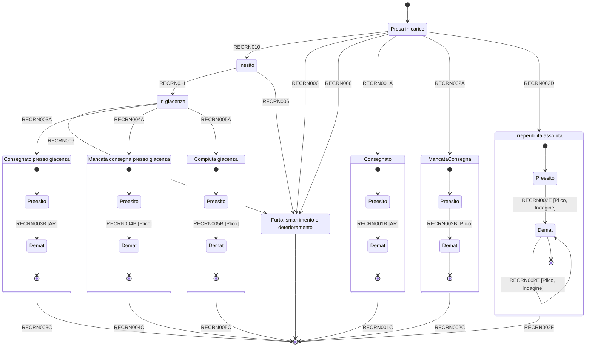
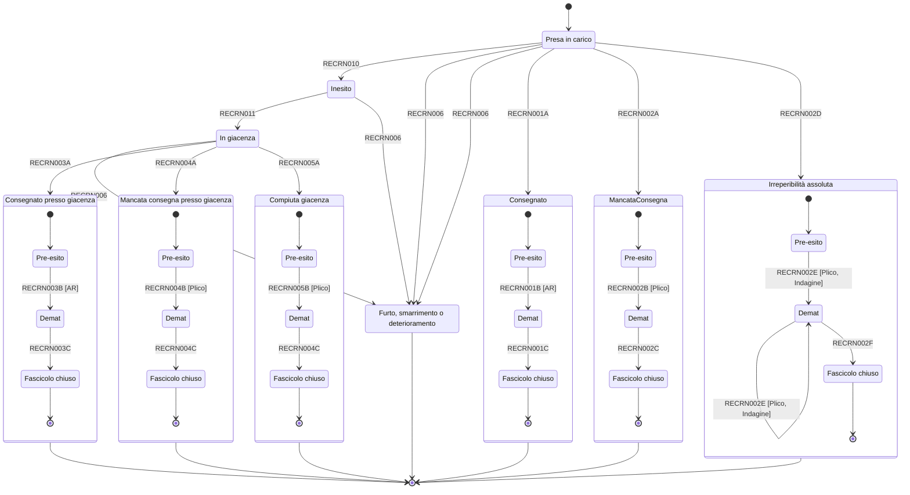
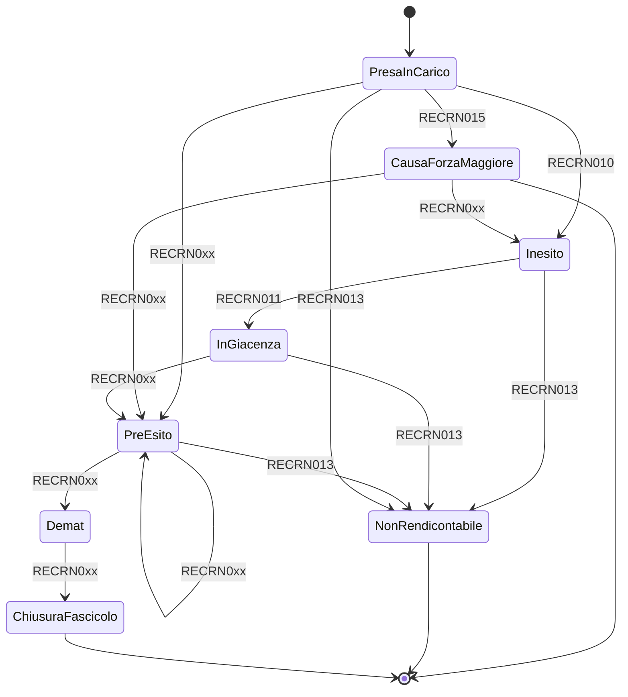

## Macchina a stati v1

```mermaid
stateDiagram-v2
  direction TB
  state Consegnato {
    direction TB
    [*] --> Preesito1
    Preesito1 --> Demat1:RECRN001B [AR]
    Demat1 --> [*]
  }
  state MancataConsegna {
    direction TB
    [*] --> Preesito2
    Preesito2 --> Demat2:RECRN002B [Plico]
    Demat2 --> [*]
  }
  state IrreperibilitaAssoluta {
    direction TB
    [*] --> Preesito2i
    Preesito2i --> Demat2i:RECRN002E [Plico, Indagine]
    Demat2i --> Demat2i:RECRN002E [Plico, Indagine]
    Demat2i --> [*]
  }
  state ConsegnatoGiacenza {
    direction TB
    [*] --> Preesito3
    Preesito3 --> Demat3:RECRN003B [AR]
    Demat3 --> [*]
  }
  state MancataConsegnaGiacenza {
    direction TB
    [*] --> Preesito4
    Preesito4 --> Demat4:RECRN004B [Plico]
    Demat4 --> [*]
  }
  state CompiutaGiacenza {
    direction TB
    [*] --> Preesito5
    Preesito5 --> Demat5:RECRN005B [Plico]
    Demat5 --> [*]
  }
  %% Presa in carico
  [*] --> PresaInCarico
  PresaInCarico --> Consegnato:RECRN001A
  PresaInCarico --> MancataConsegna:RECRN002A
  PresaInCarico --> IrreperibilitaAssoluta:RECRN002D
  PresaInCarico --> Inesito:RECRN010
  PresaInCarico --> Furto:RECRN006
  %% Chiusura fascicolo
  Consegnato --> [*]:RECRN001C
  MancataConsegna --> [*]:RECRN002C
  IrreperibilitaAssoluta --> [*]:RECRN002F
  ConsegnatoGiacenza --> [*]:RECRN003C
  MancataConsegnaGiacenza --> [*]:RECRN004C
  CompiutaGiacenza --> [*]:RECRN005C
  %% Giacenza
  Inesito --> InGiacenza:RECRN011
  InGiacenza --> Furto:RECRN006
  InGiacenza --> ConsegnatoGiacenza:RECRN003A
  InGiacenza --> MancataConsegnaGiacenza:RECRN004A
  InGiacenza --> CompiutaGiacenza:RECRN005A
  %% Furto
  PresaInCarico --> Furto:RECRN006
  Inesito --> Furto:RECRN006
  Furto --> [*]

  %% Etichette
  Preesito1:Preesito
  Demat1:Demat
  Preesito2:Preesito
  Demat2:Demat
  IrreperibilitaAssoluta:Irreperibilità assoluta
  Preesito2i:Preesito
  Demat2i:Demat
  ConsegnatoGiacenza:Consegnato presso giacenza
  Preesito3:Preesito
  Demat3:Demat
  MancataConsegnaGiacenza:Mancata consegna presso giacenza
  Preesito4:Preesito
  Demat4:Demat
  CompiutaGiacenza:Compiuta giacenza
  Preesito5:Preesito
  Demat5:Demat
  PresaInCarico:Presa in carico
  InGiacenza:In giacenza
  Furto:Furto, smarrimento o deterioramento
```

## Macchina a stati v2

```mermaid
stateDiagram-v2
  direction TB

  state Consegnato {
    direction TB

    [*] --> Preesito1
    Preesito1 --> Demat1:RECRN001B [AR]
    Demat1 --> Finale1:RECRN001C
    Finale1 --> [*]
  }
  state MancataConsegna {
    direction TB

    [*] --> Preesito2
    Preesito2 --> Demat2:RECRN002B [Plico]
    Demat2 --> Finale2:RECRN002C
    Finale2 --> [*]
  }
  state IrreperibilitaAssoluta {
    direction TB

    [*] --> Preesito2i
    Preesito2i --> Demat2i:RECRN002E [Plico, Indagine]
    Demat2i --> Demat2i:RECRN002E [Plico, Indagine]
    Demat2i --> Finale2i:RECRN002F
    Finale2i --> [*]
  }
  state ConsegnatoGiacenza {
    direction TB

    [*] --> Preesito3
    Preesito3 --> Demat3:RECRN003B [AR]
    Demat3 --> Finale3:RECRN003C
    Finale3 --> [*]
  }
  state MancataConsegnaGiacenza {
    direction TB

    [*] --> Preesito4
    Preesito4 --> Demat4:RECRN004B [Plico]
    Demat4 --> Finale4:RECRN004C
    Finale4 --> [*]
  }
  state CompiutaGiacenza {
    direction TB

    [*] --> Preesito5
    Preesito5 --> Demat5:RECRN005B [Plico]
    Demat5 --> Finale5:RECRN004C
    Finale5 --> [*]
  }

  %% Presa in carico
  [*] --> PresaInCarico
  PresaInCarico --> Consegnato: RECRN001A
  PresaInCarico --> MancataConsegna: RECRN002A
  PresaInCarico --> IrreperibilitaAssoluta: RECRN002D
  PresaInCarico --> Inesito: RECRN010
  PresaInCarico --> Furto: RECRN006
  %% Chiusura fascicolo
  Consegnato --> [*]
  MancataConsegna --> [*]
  IrreperibilitaAssoluta --> [*]
  ConsegnatoGiacenza --> [*]
  MancataConsegnaGiacenza --> [*]
  CompiutaGiacenza --> [*]
  %% Giacenza
  Inesito --> InGiacenza: RECRN011
  InGiacenza --> Furto: RECRN006
  InGiacenza --> ConsegnatoGiacenza: RECRN003A
  InGiacenza --> MancataConsegnaGiacenza: RECRN004A
  InGiacenza --> CompiutaGiacenza: RECRN005A
  %% Furto
  PresaInCarico --> Furto: RECRN006
  Inesito --> Furto: RECRN006
  Furto --> [*]

  %% Etichette
  Preesito1: Pre-esito
  Demat1: Demat
  Consegnato: Consegnato
  Finale1: Fascicolo chiuso
  Preesito2: Pre-esito
  Demat2: Demat
  Finale2: Fascicolo chiuso
  IrreperibilitaAssoluta: Irreperibilità assoluta
  Preesito2i: Pre-esito
  Demat2i: Demat
  Finale2i: Fascicolo chiuso
  ConsegnatoGiacenza: Consegnato presso giacenza
  Preesito3: Pre-esito
  Demat3: Demat
  Finale3: Fascicolo chiuso
  MancataConsegnaGiacenza: Mancata consegna presso giacenza
  Preesito4: Pre-esito
  Demat4: Demat
  Finale4: Fascicolo chiuso
  CompiutaGiacenza: Compiuta giacenza
  Preesito5: Pre-esito
  Demat5: Demat
  Finale5: Fascicolo chiuso
  PresaInCarico: Presa in carico
  Inesito: Inesito
  InGiacenza:In giacenza
  Furto: Furto, smarrimento o deterioramento

```

## Macchina a stati v3

```mermaid
stateDiagram
  direction TB
  [*] --> PresaInCarico
  PresaInCarico --> CausaForzaMaggiore:RECRN015
  PresaInCarico --> PreEsito:RECRN0xx
  CausaForzaMaggiore --> PreEsito:RECRN0xx
  PresaInCarico --> Inesito:RECRN010
  CausaForzaMaggiore --> Inesito:RECRN0xx
  CausaForzaMaggiore --> [*]
  Inesito --> InGiacenza:RECRN011
  Inesito --> NonRendicontabile:RECRN013
  InGiacenza --> NonRendicontabile:RECRN013
  InGiacenza --> PreEsito:RECRN0xx
  PreEsito --> NonRendicontabile:RECRN013
  NonRendicontabile --> [*]
  PresaInCarico --> NonRendicontabile:RECRN013
  PreEsito --> Demat:RECRN0xx
  PreEsito --> PreEsito:RECRN0xx
  Demat --> ChiusuraFascicolo:RECRN0xx
  ChiusuraFascicolo --> [*]

  %% Etichette
  PresaInCarico
  CausaForzaMaggiore
  Inesito
  InGiacenza
  NonRendicontabile
  PreEsito
  Demat
  ChiusuraFascicolo
```