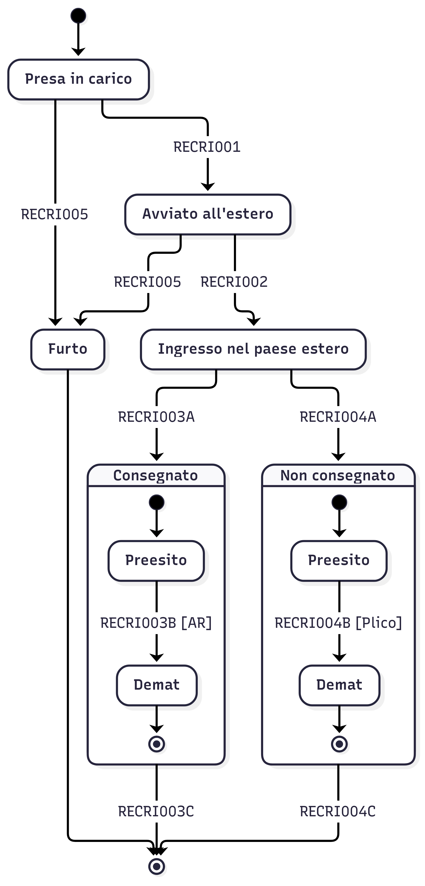

# Macchina a stati prodotto RIR



<details>
  <summary>Codice Mermaid</summary>

```
---
config:
  layout: elk
  elk:
    mergeEdges: false
    nodePlacementStrategy: NETWORK_SIMPLEX
  theme: redux
---
stateDiagram-v2
  direction TB

  state Consegnato {
    direction TB
    [*] --> Preesito1
    Preesito1 --> Demat1:RECRI003B [AR]
    Demat1 --> [*]
  }

  state NonConsegnato {
    direction TB
    [*] --> Preesito2
    Preesito2 --> Demat2:RECRI004B [Plico]
    Demat2 --> [*]
  }

  %% Presa in carico
  [*] --> PresaInCarico
  PresaInCarico --> AvviatoEstero:RECRI001
  PresaInCarico --> Furto:RECRI005

  AvviatoEstero --> IngressoPaeseEstero:RECRI002
  IngressoPaeseEstero --> Consegnato:RECRI003A
  IngressoPaeseEstero --> NonConsegnato:RECRI004A

  %% Chiusura fascicolo
  NonConsegnato --> [*]:RECRI004C
  Consegnato --> [*]:RECRI003C

  %% Furto
  AvviatoEstero --> Furto:RECRI005
  Furto --> [*]

  %% Etichette
  AvviatoEstero:Avviato all'estero
  IngressoPaeseEstero:Ingresso nel paese estero
  NonConsegnato:Non consegnato
  Preesito1:Preesito
  Demat1:Demat
  Preesito2:Preesito
  Demat2:Demat
  PresaInCarico:Presa in carico
```
</details>