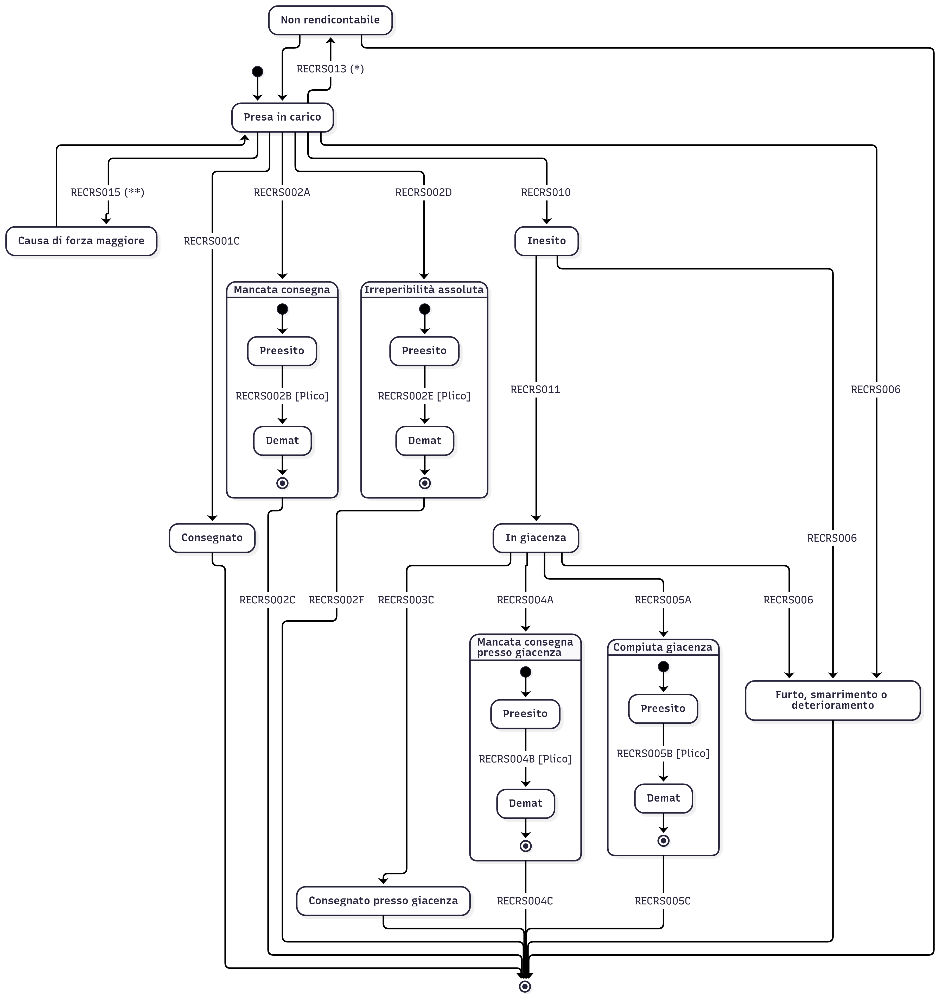

# Macchina a stati prodotto RS



(*) Trattasi di impossibilità di chiusura della rendicontazione, la quale può verificarsi sia come primo esito di rendicontazione sia a seguito di un pre-esito di rendicontazione.
Nell'eventualità in cui il recapitista dovesse rinvenire informazioni utili al completamento dell'attività di postalizzazione per suddetta raccomandta, questi dovrà procedere alla rendicontazione in conformità alla macchina a stati.

(**) Trattasi di una sospensione della postalizzazione dovuta ad una causa di forza maggiore, la postalizzazione verrà gestita dal recapitista al verificarsi di condizioni favorevoli alla consegna.

<details>
  <summary>Codice Mermaid</summary>

```
---
config:
  layout: elk
  elk:
    mergeEdges: false
    nodePlacementStrategy: NETWORK_SIMPLEX
  theme: redux
---
stateDiagram-v2

  %% Non rendicontabile
  NonRendicontabile --> PresaInCarico
  PresaInCarico --> NonRendicontabile:RECRS013 (*)
  NonRendicontabile --> [*]
  
  %% Causa forza maggiore
  CausaForzaMaggione --> PresaInCarico
  PresaInCarico --> CausaForzaMaggione:RECRS015 (**)

  direction TB
  state MancataConsegna {
    direction TB
    [*] --> Preesito2
    Preesito2 --> Demat2:RECRS002B [Plico]
    Demat2 --> [*]
  }
  state IrreperibilitaAssoluta {
    direction TB
    [*] --> Preesito2i
    Preesito2i --> Demat2i:RECRS002E [Plico]
    Demat2i --> [*]
  }
  state MancataConsegnaGiacenza {
    direction TB
    [*] --> Preesito4
    Preesito4 --> Demat4:RECRS004B [Plico]
    Demat4 --> [*]
  }
  state CompiutaGiacenza {
    direction TB
    [*] --> Preesito5
    Preesito5 --> Demat5:RECRS005B [Plico]
    Demat5 --> [*]
  }

  %% Presa in carico
  [*] --> PresaInCarico
  PresaInCarico --> Consegnato:RECRS001C
  PresaInCarico --> MancataConsegna:RECRS002A
  PresaInCarico --> IrreperibilitaAssoluta:RECRS002D
  PresaInCarico --> Inesito:RECRS010
  PresaInCarico --> Furto:RECRS006

  %% Chiusura fascicolo
  Consegnato --> [*]
  MancataConsegna --> [*]:RECRS002C
  IrreperibilitaAssoluta --> [*]:RECRS002F
  ConsegnatoGiacenza --> [*]
  MancataConsegnaGiacenza --> [*]:RECRS004C
  CompiutaGiacenza --> [*]:RECRS005C

  %% Giacenza
  Inesito --> InGiacenza:RECRS011
  InGiacenza --> Furto:RECRS006
  InGiacenza --> ConsegnatoGiacenza:RECRS003C
  InGiacenza --> MancataConsegnaGiacenza:RECRS004A
  InGiacenza --> CompiutaGiacenza:RECRS005A

  %% Furto
  Inesito --> Furto:RECRS006
  Furto --> [*]

  %% Etichette
  Preesito2:Preesito
  Demat2:Demat
  MancataConsegna:Mancata consegna
  IrreperibilitaAssoluta:Irreperibilità assoluta
  Preesito2i:Preesito
  Demat2i:Demat
  ConsegnatoGiacenza:Consegnato presso giacenza
  MancataConsegnaGiacenza:Mancata consegna<br>presso giacenza
  Preesito4:Preesito
  Demat4:Demat
  CompiutaGiacenza:Compiuta giacenza
  Preesito5:Preesito
  Demat5:Demat
  PresaInCarico:Presa in carico
  InGiacenza:In giacenza
  Furto:Furto, smarrimento o deterioramento
  CausaForzaMaggione:Causa di forza maggiore
  NonRendicontabile:Non rendicontabile
```
</details>