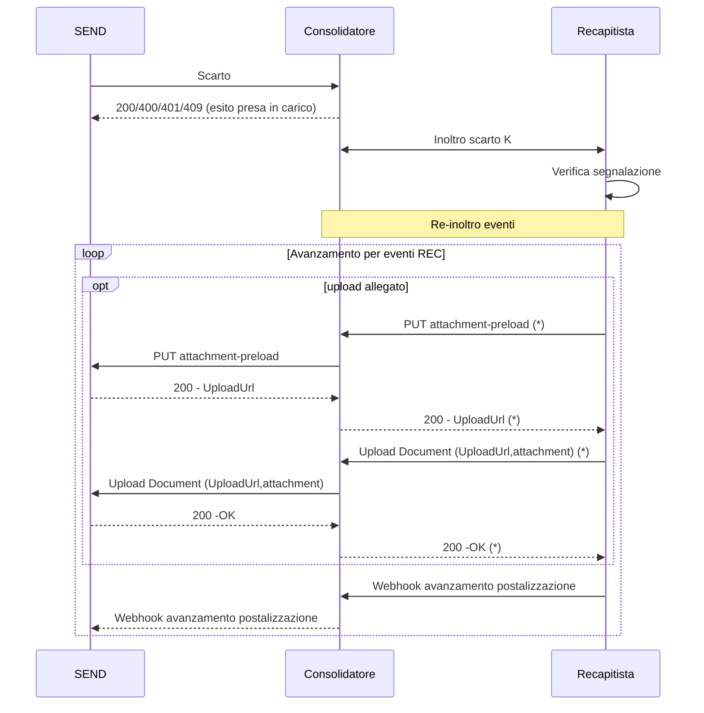

## Gestione errori di rendicontazione
E' possibile che gli eventi dei recapitisti veicolati tramite il consolidatore siano contrastanti in base alle informazioni su SEND. I tali casi SEND può , tramite il consolidatore, segnalare un errore di rendicontazione attraverso le seguente API 

