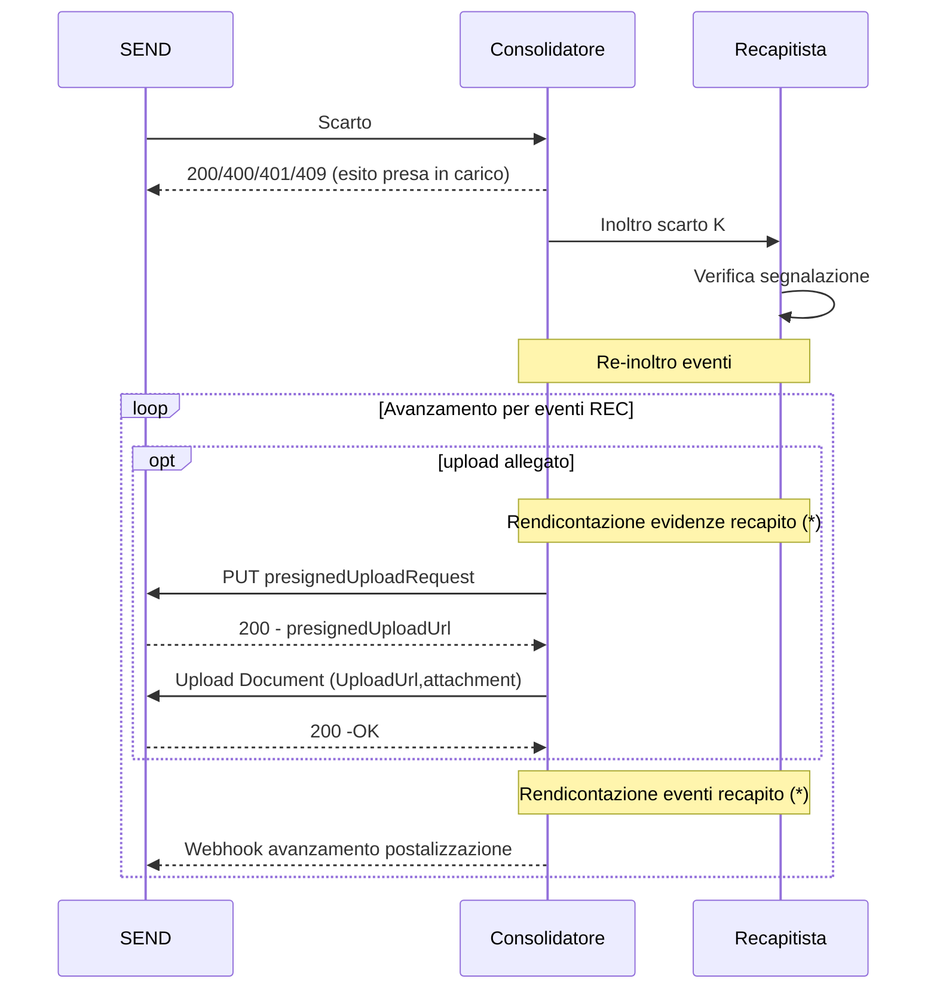

## Gestione errori di rendicontazione
E' possibile che gli eventi dei recapitisti veicolati tramite il consolidatore siano contrastanti in base alle informazioni su SEND. 
In tali casi SEND può, tramite il consolidatore, segnalare un errore di rendicontazione attraverso una specifica API secondo il flusso qui descritto.
La specifica API verrà definita a valle dell'aggiudicazione della gara.

(*) Fare riferimento alla specifica di integrazione tra Consolidatore e Recapitisiti