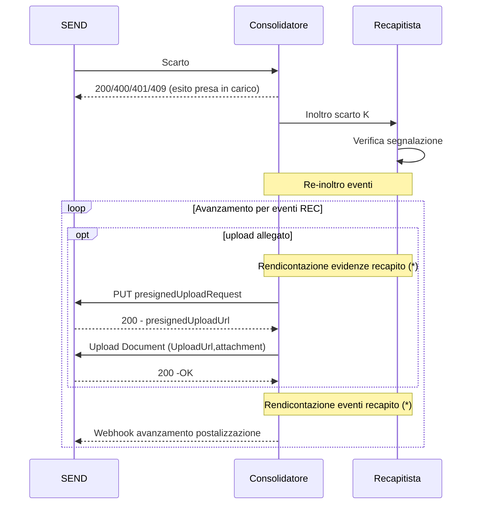

## Gestione errori di rendicontazione
E' possibile che gli eventi dei recapitisti veicolati tramite il consolidatore siano contrastanti in base alle informazioni su SEND. 
In tali casi SEND può, tramite il consolidatore, segnalare un errore di rendicontazione attraverso una specifica API secondo il flusso qui descritto.
La segnalazione viene effettuata tramite l'operazione 
`sendPaperDeliveryReconciliationErrorReport` (`POST /piattaforma-notifiche-ingress/v1/paper-deliveries-recon-error-report`), 
definita in [consolidatore-v1.yml](/Users/giacomo.vallorani/src/pn-postalizzazione-api/docs/openapi/consolidatore-v1.yml), 
a cui SEND comunica il `requestId` della spedizione impattata insieme ai dettagli dell'errore riscontrato, così 
che il consolidatore possa inoltrare la segnalazione al recapitista e automatizzare il processo di re-invio degli eventi corretti.

(*) Fare riferimento alla specifica di integrazione tra Consolidatore e Recapitisiti