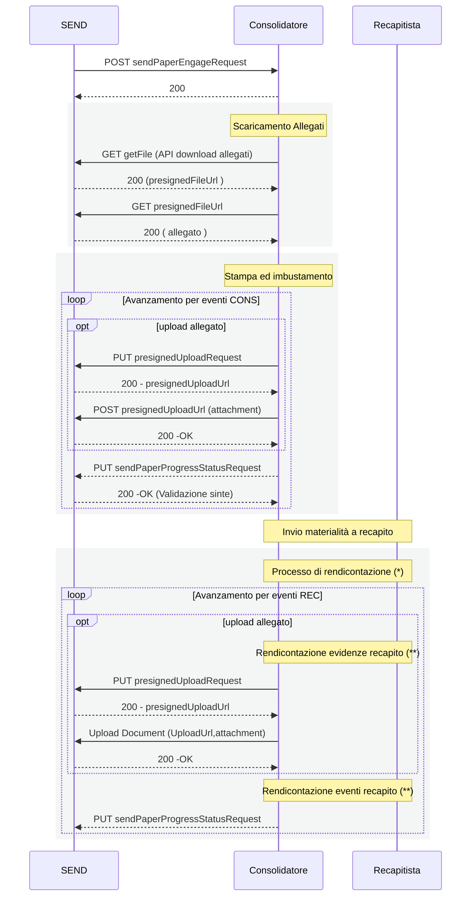

# Servizio Consolidatore - Specifica API

Questo documento descrive le specifiche e il flusso di integrazione richiesto per realizzare il servizio di consolidatore secondo lo standard PagoPA.

## Descrizione

Il consolidatore, raggiungibile tramite link diretto privato, espone le seguenti API REST:

- **POST** `/piattaforma-notifiche-ingress/v1/paper-deliveries-engagement`: ricezione richieste di invio corrispondenza cartacea.
- **GET** `/piattaforma-notifiche-ingress/v1/paper-deliveries-progresses/{requestId}`: consultazione avanzamento postalizzazione.

Tutte le API richiedono autenticazione tramite header `x-pagopa-extch-service-id` e `x-api-key`.

## Gestione degli Allegati

Una richiesta di postalizzazione ( e suoi avanzamenti ) possono contenere allegati. Tutti gli allegati sono gestiti all'interno della SEND tramite il servizio SafeStorage. 
In particolare un consolidatore / recapitista sarà in grado di. : 
- acquisire allegati presenti all'interno di una richiesta di postalizzazione 
- caricare allegati che saranno associati ad uno stato di avanzamento

## Flusso Principale

1. **SEND** invia una richiesta di postalizzazione tramite `POST /paper-deliveries-engagement`.
1. Il consolidatore valida e registra la richiesta.
1. Il consolidatore scarica gli allegati tramite le API della piattaforma.
1. Il consolidatore invia notifiche di avanzamento tramite [webhook](./openapi/send-ec-v1.yml).
1. Il consolidatore si integra con lo specifico recapitista per trasmettere la richiesta di postalizzazione
1. Il consolidatore riceve avanzamenti sulla specifica postalizzazione tramite l'integrazione descritta nel -documento tbd- che inoltra a sua volta a SEND mediante [webhook](./openapi/send-ec-v1.yml).
5. **SEND** può interrogare lo stato tramite `GET /paper-deliveries-progresses/{requestId}`.
paper-replicas-progresses/{requestId}`.

### Sequence Diagram

(*) Ogni prodotto postale segue una specifica rendicontazione con eventi dedicati, sequenze dedicate ed evidenze di recapito. Fare riferimento alla documentazione specifica
* [Atto giudiziario 890](diagrams/890.md)
* [Raccomandata AR nazionale](diagrams/AR.md)
* [Raccomanata Semplice nazionale](diagrams/RS.md)
* [Raccomanata AR Internazionale](diagrams/RIR.md)
* [Raccomandata Semplice Internazionale](diagrams/RIS.md)

Per gli approfondimenti sugli stati fare riferimento alle appendici:
* [statusCode](appendices/PaperProgressStatusEvent_statusCode.csv)
* [documentType](appendices/PaperProgressStatusEvent_documentType.csv)
* [deliveryFailureCause](appendices/PaperProgressStatusEvent_deliveryFailureCause.csv)

(**) Fare riferimento alla specifica di integrazione tra Consolidatore e Recapitisiti descritta nell'appendice [Consolidatore-Integrazione_sistemi_Postalizzazione_e_Recapito](docs/appendices/Consolidatore/Consolidatore-Integrazione_sistemi_Postalizzazione_e_Recapito.docx)
