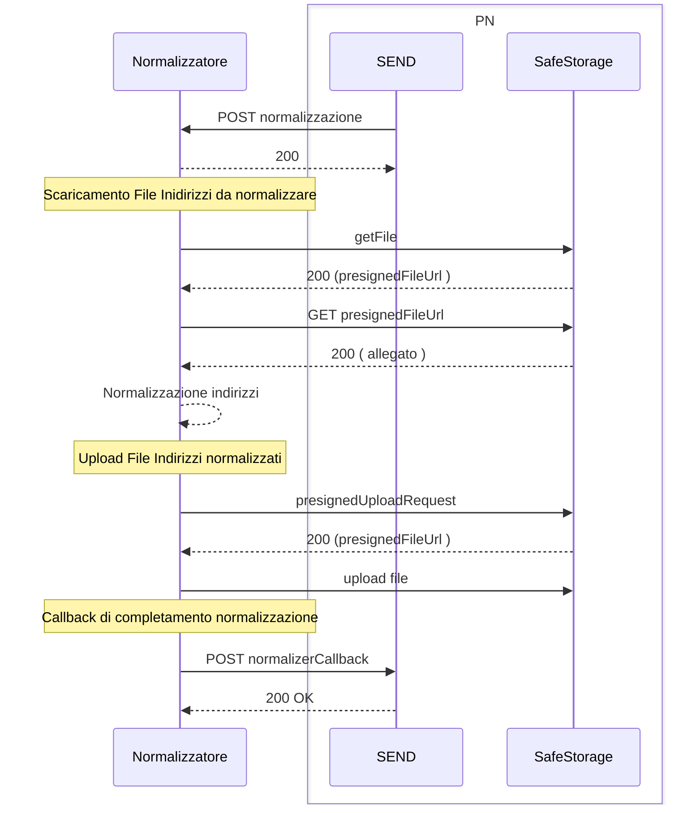
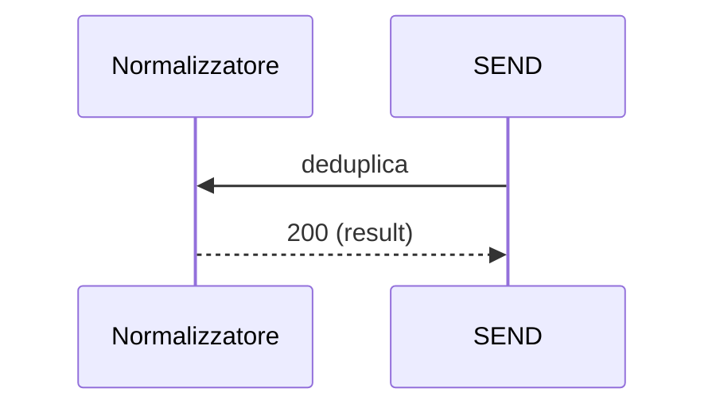

# Servizio Normalizzatore - Specifica API

Questo documento descrive le specifiche API REST  e il flusso di integrazione richiesto per realizzare il servizio di normalizzatore descritto al capitolo 8.1 dell'allegato 03 " Capitolato tecnico Consolidatore". 

Il servizio consente così di garantire la qualità e la coerenza degli indirizzi utilizzati nei processi di postalizzazione, riducendo errori e duplicazioni; offre due funzionalità :

1. *Normalizzazione di indirizzi*
2. *Deduplica di indirizzi*

## Normalizzazione di indirizzi

Utilizzando un pattern di comunicazione asincrona ,ed utilizzando come archivio il servizio SafeStorage (vedi sezione "Gestione degli Allegati"),  il Servizio di Normalizzatore riceve una lista di indirizzi da normalizzare. L'operazione viene presa in carico ed una volta processato il file degli indirizzi viene prodotto un nuovo file contenente il risultato dell'operazione di normalizzazione. Il completamento dell'operazione viene notificato tramite una webhook ( specificata all'interno del file pn-normalizzatore-webhook-v1.yaml) 

### API Utilizzate 

- *normalizzazione* : Richiesta di normalizzazione (spec: normalizatore/pn-normalizzatore-v1.yaml )
- *normalizerCallback* : Completamento dell'operazione ( spec: normalizzatore/pn-normalizzatore-webhook-v1.yaml)

### Gestione degli Allegati

La richiesta di normalizzazione batch prevede che gli indirizzi da normalizzare e i risultati normalizzati vengano scambiati mediante file. La gestione dei file verrà fatta tramite il servizio SafeStorage. 

In particolare sono rese disponibili le seguenti operazioni : il normalizzatore sarà in grado di : 

- *presignedUploadRequest* : Richiesta di una URL (presigedUrl) da utilizzare per il caricamento del file ( spec: normalizzatore/pn-normalizzatore-webhook-v1.yaml).
- *getFile* : lettura dei metadati e del contenuto di un allegato( spec: normalizzatore/pn-normalizzatore-webhook-v1.yaml)

### Sequence Diagram

1. **SEND** invia una richiesta di normalizzazione tramite `POST /normalizzazione`.
1. Il normalizzatore valida e registra la richiesta.
1. Il normalizzatore scarica l'allegato tramite le API della piattaforma.
1. Il normalizzatore comunica il risultato tramite il webhook [normalizer-callback](./openapi/normalizzatore/pn-normalizzatore-webhook-v1-v1.yml).

## Deduplica

Espone un endpoint sincrono per confrontare due indirizzi e determinare se sono equivalenti, applicando prima la normalizzazione e poi la verifica di uguaglianza secondo le regole definite.

Il servizio di deduplica è un servizio sincrono esposto tramite api `POST /deduplica`.

### API Utilizzate 

- *deduplica* : Richiesta di deduplicazione (spec: normalizatore/pn-normalizzatore-deduplica-v1.yaml )

### Sequence Diagram

