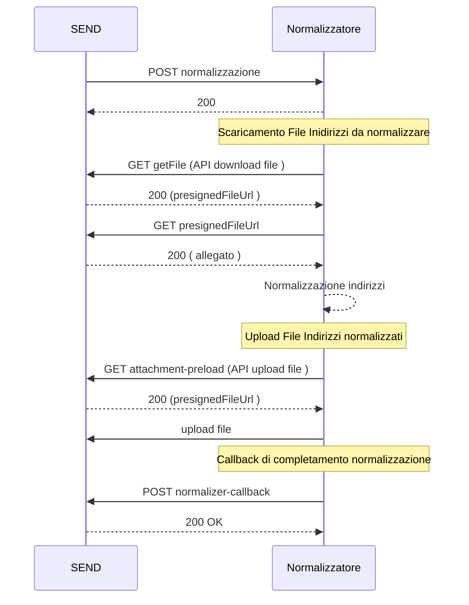

# Servizio Normalizzatore - Specifica API

Questo documento descrive le specifiche e il flusso di integrazione richiesto per realizzare il servizio di normalizzatore secondo lo standard PagoPA.

## Descrizione

Il normalizzatore, raggiungibile tramite link diretto privato, espone le seguenti API REST:

- **POST** `/send-normalizzatore-ingress/v1/normalizzazione:`: richiesta di normalizzazione batch
- **POST** `/send-normalizzatore-ingress/v1/deduplica:`: richiesta di deduplica

Tutte le API richiedono autenticazione tramite header `pn-address-manager-cx-id` e `x-api-key`.

## Gestione degli Allegati

La richiesta di normalizzazione batch prevede che gli indirizzi da normalizzare e i risultati normalizzati vengano scambiati mediante file. La gestione dei file verrà fatta tramite il servizio SafeStorage. 
In particolare il normalizzatore sarà in grado di : 
- Acquisire il documento contenente la lista di indirizzi da normalizzare
- Caricare il documento contenente la lista degli indirizzi normalizzati

## Normalizazione Batch

1. **SEND** invia una richiesta di normalizzazione tramite `POST /normalizzazione`.
1. Il normalizzatore valida e registra la richiesta.
1. Il normalizzatore scarica l'allegato tramite le API della piattaforma.
1. Il normalizzatore comunica il risultato tramite il webhook [normalizer-callback](./openapi/normalizzatore/pn-normalizzatore-webhook-v1-v1.yml).

### Sequence Diagram

## Deduplica

Il servizio di deduplica è un servizio sincrono esposto tramite api `POST /deduplica`.