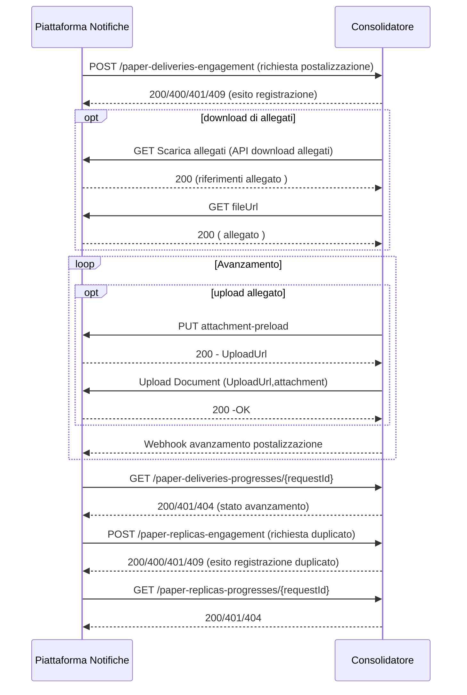

# Servizio Consolidatore - Specifica API

Questo documento descrive le specifiche e il flusso di integrazione richiesto per realizzare il servizio di consolidatore secondo lo standard PagoPA.

## Descrizione

Il consolidatore, raggiungibile tramite link diretto privato, espone le seguenti API REST:

- **POST** `/piattaforma-notifiche-ingress/v1/paper-deliveries-engagement`: ricezione richieste di invio corrispondenza cartacea.
- **GET** `/piattaforma-notifiche-ingress/v1/paper-deliveries-progresses/{requestId}`: consultazione avanzamento postalizzazione.
- **POST** `/piattaforma-notifiche-ingress/v1/paper-replicas-engagement`: richiesta generazione duplicato.
- **GET** `/piattaforma-notifiche-ingress/v1/paper-replicas-progresses/{requestId}`: consultazione avanzamento richiesta duplicato.

Tutte le API richiedono autenticazione tramite header `x-pagopa-extch-service-id` e `x-api-key`.

## Gestione degli Allegati

Una richiesta di postalizzazione ( e suoi avanzamenti ) possono contenere allegati. Tutti gli allegati sono gestiti all'interno della Piattaforma Notifiche tramite il servizio SafeStorage. 
In particolare un consolidatore / recapitista sarà in grado di. : 
- acquisire allegati presenti all'interno di una richiesta di postalizzazione 
- caricare allegati che saranno associati ad uno stato di avanzamento

## Flusso Principale

1. **Piattaforma Notifiche** invia una richiesta di postalizzazione tramite `POST /paper-deliveries-engagement`.
2. Il consolidatore valida e registra la richiesta.
3. Il consolidatore scarica gli allegati tramite le API della piattaforma.
4. Il consolidatore invia notifiche di avanzamento tramite [webhook](./send-pn-ec-v1.yml).
5. **Piattaforma Notifiche** può interrogare lo stato tramite `GET /paper-deliveries-progresses/{requestId}`.
6. Per richieste di duplicato, il flusso è analogo usando i path `/paper-replicas-engagement` e `/paper-replicas-progresses/{requestId}`.

## Sequence Diagram

